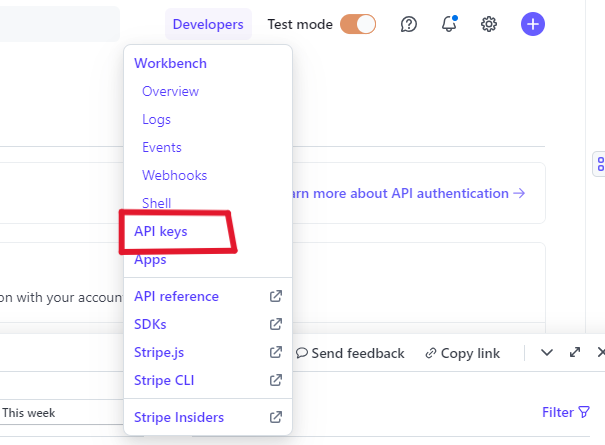
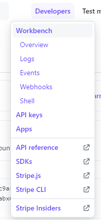
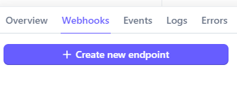
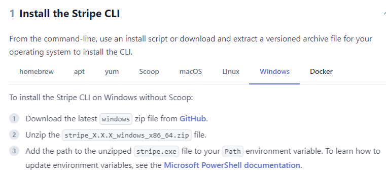

# Deployment and Payment setup

- The app was deployes to [Heroku](https://heroku.com/).
- The PostgreSQL database was provided by [Code Institute](https://codeinstitute.net/se/).
- You can access the website through [this link](https://silver-sands-estate-27b0dac465b2.herokuapp.com/)

---

## Payment Setup with Stripe

1. Register a stripe account at https://dashboard.stripe.com/register.
2. Go to the 'API keys' page via the developers tab:



3. Copy the `public key` and `secret key` to the `env.py` file.

4. Add the following setting to `settings.py`:

```python
  STRIPE_PUBLIC_KEY = os.environ.get("STRIPE_PUBLIC_KEY")
  STRIPE_SECRET_KEY = os.environ.get("STRIPE_SECRET_KEY")
```

5. Install stripe package:

```python
  pip3 install stripe
```
6. Configure the webhook url in Stripe dashboard
- In checkout app `urls.py` create a route that matches the endpoint you want Stripe to send events to. 
    ``` python
      path('wh/', webhook, name='webhook'),
    ```

- Locate the Webhooks section in the developers section of your Stripe account:



- Add a new endpoint, and enter the URL of your webhook endpoint 



- Select all events to listen for and save the webhook.

7. Create an order model with the required fields in the checkout app.

8. Create the `OrderForm' in the checkout app.

9. Add the Order form to the checkout html template.

10. Add fieldset to contain the stripe element to be handled through javascript.

```html
<fieldset class="px-3">
    <legend class="fieldset-label small text-black px-2 w-auto">Payment</legend>
    <!-- A Stripe card element will go here -->
    <div class="mb-3" id="card-element"></div>
    <!-- Used to display card errors -->
    <div class="mb-3 text-danger" id="card-errors" role="alert"></div>
    <!-- Pass the client secret to the view so we can get the payment intent id -->
    <input type="hidden" value="{{ client_secret }}" name="client_secret">
</fieldset>                   
```
11. Create a View to handle integration with Stripe for the payment setup:
  - Get public key: `stripe_public_key = settings.STRIPE_PUBLIC_KEY`
  - Get private key: `stripe_secret_key = settings.STRIPE_SECRET_KEY`
  - Calculate the orders total value and convert it to cents for stripe total as it processes payments in the smallest currency unit (Cents):
    ``` python
      current_bag = bag_contents(request)
      total = current_bag['grand_total']
      stripe_total = round(total * 100)
    ```
  - Set the Stripe API Key, which is required to authenticaree the request.
    - `stripe.api_key = stripe_secret_key`
  - Create the intent (`PaymentIntent`) using Stripe's API to track the payment process and make sure the payment can be captured securely and efficiently. Parameters `stripe_total` as the amount the user will be charged in cents, and `currecny` to specify AUD specified in the projects settings:
    - `intent = stripe.PaymentIntent.create(amount=stripe_total,  currency=settings.STRIPE_CURRENCY,)`
  - Retrieve the `client_secret` from the created `PaymentIntent` to be used by the frontend to securly complete the payment process. Ensuring the payment session is connected to the backend securely without exposing important information like the API key:
    - `client_secret = intent.client_secret`
  
  - Within the handling of the POST request of the `OrderForm` submission, if the `OrderForm` is valid, the order is created. Extract the `pid` using the `client_secret` and is saved with the order as `stripe_pid`. The stripe_pid` links the order to the Stripe PaymentIntent so the payments can be tracked and verified later by referencing the Stripe pid. 
    ``` python
      pid = request.POST.get('client_secret').split('_secret')[0]
      order.stripe_pid = pid
    ```
  - Create `context` to be passed to the checkout template used to display the order form and interact with Stripes payment API. Include the following data:
    ``` python
      context = {
        'order_form': order_form,
        'stripe_public_key': stripe_public_key,
        'client_secret': client_secret,
      }
    ```

12. Create a view to handle caching checkout data before the payment is confirmed. This view will modify the PaymentIntent object in Stripe to include extra metadata such as the user's shopping bag, save info, and username.
- Retrieve the `client_secret` from the POST data and split it to extract the pid:
  ``` python
    pid = request.POST.get('client_secret').split('_secret')[0]
  ```
- Set the Stripe secret key to authenticate the request:
  ``` python
    stripe.api_key = settings.STRIPE_SECRET_KEY
  ```
- Modify the `PaymentIntent` object using Stripe's API to include the following metadata:
  - The contents of the shopping bag, retrieved from the session and serialized as JSON.
  - Whether the user has opted to save their info.
  - The username of the currently logged-in user.
  ``` python
    stripe.PaymentIntent.modify(pid, metadata={
        'bag': json.dumps(request.session.get('bag', {})),
        'save_info': request.POST.get('save_info'),
        'username': request.user,
    })
  ```
- If successful return a 200 HTTP response and if it fails return a 400 HTTP response.

13. Create a view to listen for incoming webhooks from Stripe. This view will verify the webhook signature and process different event types sent by Stripe. 
- Add `@require_POST` to handle only POST requests.
- Add `@csrf_exempt` to bypass CSRF verification.
  ``` python
    @require_POST
    @csrf_exempt
    def webhook(request):
  ```
- Initialise Stripe using the secret key stored in the settings.
  ``` python
      wh_secret = settings.STRIPE_WH_SECRET
      stripe.api_key = settings.STRIPE_SECRET_KEY
  ```
- Retrieve the raw request body and Stripe signature header from the request.
  ``` python
      payload = request.body
      sig_header = request.META['HTTP_STRIPE_SIGNATURE']
  ```
- Use `stripe.Webhook.construct_event` to verify the webhook signature and construct the event, and handle exceptions for invalid JSON and signature verification failures.
  ``` python
      try:
          event = stripe.Webhook.construct_event(payload, sig_header, wh_secret)
      except ValueError as e:
          return HttpResponse(status=400)
      except stripe.error.SignatureVerificationError as e:
          return HttpResponse(status=400)
      except Exception as e:
          return HttpResponse(content=e, status=400)
  ```

- Create an instance of `StripeWH_Handler` to manage different event types.
- Map specific Stripe webhook events (e.g., `payment_intent.succeeded`, `payment_intent.payment_failed`) to their corresponding handler methods.
  ``` python
    handler = StripeWH_Handler(request)

    event_map = {
        'payment_intent.succeeded': handler.handle_payment_intent_succeeded,
        'payment_intent.payment_failed': handler.handle_payment_intent_payment_failed,
    }
  ```
- Execute the appropriate event handler based on the event type and returns the response generated by the handler.
  ``` python 
    event_type = event['type']
    event_handler = event_map.get(event_type, handler.handle_event)
    response = event_handler(event)

    return response
  ```

14. Create the `webhook_handler.py` to handle Stripe webhook events. To ensure the checkout application can respond to payment events correctly and maintain accurate order records based on transactions processed through Stripe.
- Add `handle_event` method to handle generic webhook events from Stripe. Return an achknowledgement response to show the webhook was recieved.
  ``` python
    def handle_event(self, event):
        """Handle a generic/unknown/unexpected webhook event"""
        return HttpResponse(
            content=f'Webhook received: {event["type"]}',
            status=200)
  ```
- Create the `handle_payment_intent_succeeded` method for handling `payment_intent.succeeded` events. This method will extract the payment intent details and perform necessary actions such as updating or creating orders based on the payment information.
  ``` python
    def handle_payment_intent_succeeded(self, event):
      """Handle the payment_intent.succeeded webhook from Stripe"""
      intent = event.data.object
      pid = intent.id
      bag = intent.metadata.bag
      # Further processing...

  ```
- Create the `handle_payment_intent_payment_failed` to handle `payment_intent.payment_failed` events. This method will provide a simple acknowledgment response indicating that the failure event was received.
  ``` python 
    def handle_payment_intent_payment_failed(self, event):
      """Handle the payment_intent.payment_failed webhook from Stripe"""
      return HttpResponse(
          content=f'Webhook received: {event["type"]}',
          status=200)
  ```

- Within the payment success handler, check for existing orders based on the payment and user details. If no matching order is found, create a new order and associate the relevant items from the user's shopping bag.
  ``` python
    if order_exists:
        # Send confirmation email if the order exists
        self._send_confirmation_email(order)
    else:
        # Create a new order if it doesn't exist
        order = Order.objects.create(
            full_name=shipping_details.name,
            email=billing_details.email,
            # Further details...
        )
  ```

- Implement a method to send a confirmation email to the customer once the order has been successfully processed. This method will generate the email subject and body using templates.
  ``` python
    def _send_confirmation_email(self, order):
      """Send a confirmation email to the customer"""
      send_mail(
          subject,
          body,
          settings.DEFAULT_FROM_EMAIL,
          [cust_email]
      )
  ```

15. Add extra js block to the checkout template and include `stripe_public_key`, `client_secret` and script tags with stripe_elements.js:
    ``` python
    
        {{ stripe_public_key|json_script:"id_stripe_public_key" }}
        {{ client_secret|json_script:"id_client_secret" }}
        <script src=""></script>
    
    ```
    
16. In the stripe_elements.js set up the key elements, extract the Stripe public key and client secret from the checkout.html, and create a stripe instance using the public key and initialise the Stripe elements object:
    ``` js
      var stripePublicKey = $('#id_stripe_public_key').text().slice(1, -1);
      var clientSecret = $('#id_client_secret').text().slice(1, -1);
      var stripe = Stripe(stripePublicKey);
      var elements = stripe.elements();
    ```

17. Create a `card` element using the Stripe elements and mount it to the designated  `#card-element` div.
    ``` js
      var card = elements.create('card', { style: style });
      ard.mount('#card-element');
    ```

18. Add an event listener to the card input field to handle and display card validation errors:
    ``` js
      card.addEventListener('change', function (event) { ...
    ```

19. After posting the order data, confirm the card payment using `stripe.confirmCardPayment()` with the client secret. Pass the user's billing and shipping details to Stripe for payment processing.
    ``` js
      $.post(url, postData).done(function () {
          stripe.confirmCardPayment(clientSecret, {
              payment_method: {
                  card: card,
                  billing_details: { ...
    ```
  
20. If the payment is successful, submit the form to complete the order, and if it fails display error message to the user and re-enable the form so they can correct the issue.

21. Clear any previous validation errors using the `clearFormErrors()` function before re-validating the form.

22. To test the user's payment, you need to create a test payment intent with the card data provided by the stripe:

    -  No auth: 4242424242424242

    -  Auth: 4000002500003155

    -  Error: 4000000000009995

23. Create a `checkout_success.html` to redirect the user after a successful payment. Within the checkout view if the POST request submits the form successfully redirect the user:
    ``` python
        return redirect(reverse(
        'checkout_success', args=[order.order_number]))
    ```

24. Set app stripe backend:
  - Go to [Stripe Docs. Stripe CLI](https://stripe.com/docs/stripe-cli)
  - Download the stripe-cli file depending on your operating system.

  - In my case, I downloaded the file for Windows:

  

  - Go to the link provided and download the file from [GitHub](https://github.com/stripe/stripe-cli/releases/tag/v1.21.8).


  - Unzip the stripe_X.X.X_windows_x86_64.zip file.
  
  - Add the path to the unzipped stripe.exe file to your Path environment variable.

  - Open the terminal and login and authenticate your Stripe uer account to generate a set of restricted keys, using:

      `$ stripe login`

  - Press the Enter key on your keyboard to complete the authentication process in your browser.

## Local deployment

1. Clone the repository.

    - ```git clone https://github.com/AlvaLind/project-5-silver-sands.git```

2. Go to the ```project-5-silver-sands``` directory.

    - ```cd project-5-silver-sands```

3. Create a virtual environment.

    - ```python3 -m venv venv```

    - ```source venv/bin/activate```

4. Install all dependencies.

    - ```pip install -r requirements.txt```

5. Create a ```env.py``` file.

    - ```touch env.py```

6. Add the following lines to ```env.py```:

    - ```import os```
    - ```os.environ["SECRET_KEY"]``` = your secret key.
    - ```os.environ["DEBUG"]``` = "True" or "False" depending on whether you are in development or production.
    - ```os.environ["DEVELOPMENT"]``` = "True" or "False" depending on whether you are in development or production.
    - ```os.environ["DATABASE_URL"]``` = your database url.
    - ```os.environ["CLOUDINARY_CLOUD_NAME"]``` = your cloudinary cloud name.
    - ```os.environ["CLOUDINARY_API_KEY"]``` = your cloudinary api key.
    - ```os.environ["CLOUDINARY_API_SECRET"]``` = your cloudinary api secret.
    - ```os.environ["STRIPE_PUBLIC_KEY"]``` = your stripe public key.
    - ```os.environ["STRIPE_SECRET_KEY"]``` = your stripe secret key.
    - ```os.environ["STRIPE_WEBHOOK_SECRET"]``` = your stripe webhook secret key.
    - ```os.environ.setdefault["AWS_ACCESS_KEY_ID"]``` = your Amazon AWS key id.
    - ```os.environ.setdefault("AWS_SECRET_ACCESS_KEY"]``` = your Amazon AWS secret key.

7. Create and migrate the database.

---

## Heroku Deployment


1. Create a Heroku account if you don't already have one.

2. Create a new app on Heroku.

    1. Go to the [Heroku dashboard](https://dashboard.heroku.com/apps).
    2. Click on the "New" button.
    3. Click on the "Create new app" button.
    4. Choose a name for your app.
    5. Choose a region.
    6. Click on the "Create app" button.

3. In your app go to the "Resources" tab.

    1. Add a Heroku Postgres database.

4. In your app, go to the "Settings" tab, press "Reveal Config Vars", and add the following config vars if they are not already set:

    1. ```ALLOWED_HOSTS``` = your heroku domain name.
    2. ```CLOUDINARY_CLOUD_NAME``` = the cloud name you used when creating your cloudinary account.
    3. ```CLOUDINARY_API_KEY``` = the api key you got when created your cloudinary account.
    4. ```CLOUDINARY_API_SECRET``` = the api secret you got when created your cloudinary account.
    5. ```DATABASE_URL``` = the url of your heroku postgres database.
    6. ```REDIS_URL``` = the url of your heroku redis database.
    7. ```SECRET_KEY``` = a secret key for your app.
    8. ```EMAIL_HOST_USER``` = the email address you going to use to send emails.
    9. ```EMAIL_HOST_PASSWORD``` = the password for the email address you are using.
    10. ```DEBUG``` = True during development, False during production.
    11. ```DISABLE_COLLECTSTATIC``` = 1 during development. Remove this when deploying to production.
    12. ```STRIPE_PUBLIC_KEY``` = the public key you got when created your stripe account.
    13. ```STRIPE_SECRET_KEY``` = the secret key you got when created your stripe account.
    14. ```STRIPE_WEBHOOK_SECRET``` = the secret key you got when created your stripe account. 
    15. ```AWS_ACCESS_KEY_ID``` = the access key id provided by amazons AWS S3 bucket.
    16. ```AWS_SECRET_ACCESS_KEY``` = the access secret key provided by amazons AWS S3 bucket.

5. Obtain Your AWS S3 Bucket Access Key ID and Secret Access Key:

    1. Go to the [AWS Management Console](https://aws.amazon.com/console/).
    2. Log in to your AWS account or create one if you don’t have an account.
    3. In the AWS Management Console, navigate to the **IAM (Identity and Access Management)** service.
    4. Click on **Users** in the left sidebar.
    5. Select the user you want to generate keys for, or create a new user.
      - If creating a new user, ensure you grant **Programmatic access** and attach the necessary permissions (like **AmazonS3FullAccess** or specific S3 bucket permissions).
    6. Once you've selected or created the user, click on the **Security credentials** tab.
    7. Scroll down to the **Access keys** section and click on **Create access key**.
    8. After creating, you will see your **Access Key ID** and **Secret Access Key**. Copy these values.
      - Make sure to store your secret access key securely; you won’t be able to view it again after this step.
    9. Paste these values into the config vars on Heroku and your `env.py` file.

6. Obtain Your Stripe Keys
    1. Go to the [Stripe Dashboard](https://dashboard.stripe.com/).
    2. Log in to your Stripe account or create a new account if you don’t have one.
    3. In the Stripe Dashboard, navigate to the **Developers** section on the left sidebar.
    4. Click on **API keys** under the **API** tab.
      - You will see both the **Publishable key** and the **Secret key**. Copy these values and paste them into your Heroku config vars:
        - `STRIPE_PUBLIC_KEY`: This is your **Publishable key**.
        - `STRIPE_SECRET_KEY`: This is your **Secret key**.
    5. To obtain the **Webhook Secret**, go to the **Webhooks** section in the Developers menu.
    6. Click on the endpoint you created for webhooks.
      - You will see the **Signing secret** for the webhook; copy this value and paste it into your Heroku config vars as `STRIPE_WEBHOOK_SECRET`.

    6. In your app go to the "Deploy" tab.

    1. If it's already possible, connect your Heroku account to your GitHub account and then click on the "Deploy" button.
    2. If not, you need to copy the Heroku CLI command to connect your heroku app and your local repository.

        - ```heroku git:remote -a silver_sands```

7. Go to your local repository.

8. Login to your Heroku account in your terminal and connect your local repository to your heroku app.

    1. ```heroku login -i``` - Enter all your Heroku credentials it will ask for.
    2. Paste the command you copied from step 5 into your terminal.

9. Create Procfile.

    This project uses Daphne server for its ability to run asynchronous applications in order to implement tech support chats in the future, so in this case if you want to implement chat functionality as well, you have to add the following to Procfile:

    - ```release: python manage.py migrate``` - this command will apply all migrations every time you re-deploy the app.
    - ```web: daphne ecommerce_project.asgi:application --port $PORT --bind 0.0.0.0 -v2``` - this command will run the app.
    - ```worker: python manage.py runworker -v2 channel_layer``` - this command will run the worker for the channel layer to run the async tasks.

10. Create ```requirements.txt```. This can be done by running the following command:

    - ```pip freeze > requirements.txt```
    or
    - ```pipreqs requirements.txt``` - if you have pipreqs installed.

11. Add and commit all changes.

12. Push your changes to Heroku.

    - ```git push heroku master```
    or
    - ```git push heroku main```

13. Check your app's logs in heroku dashboard and ensure everything is working.

14. After the development is done, you can change the ```DEBUG``` config var to ```False``` and remove the ```DISABLE_COLLECTSTATIC``` config var from the config vars on heroku.

To get Cloudinary cloud name, API key, and API secret:

1. Go to the [Cloudinary website](https://cloudinary.com/).

2. Log in to your account or sign up if you don't have an account.

3. Go to the [Cloudinary dashboard](https://cloudinary.com/console/).

4. At the top of the page, you will see your cloud name, API key, and API secret.

5. To reveal API secret, hover over the API key container and click on the button that looks like an eye.

6. Copy these values and paste them into the config vars on Heroku and into your `env.py` file.

To get stripe public key, secret key, and webhook secret:

**Please go to the Payment Setup section in the readme file for more information.**

[Payment Setup](#payment-setup)

*If you find any difficulties with the installation, please, visit the following project's [GitHub repository](https://github.com/AlvaLind/page-turner?tab=readme-ov-file#deployment:~:text=test%2Drelated%20documentation.-,Deployment,-The%20application%20has), where you can find the images of the installation process.*

---