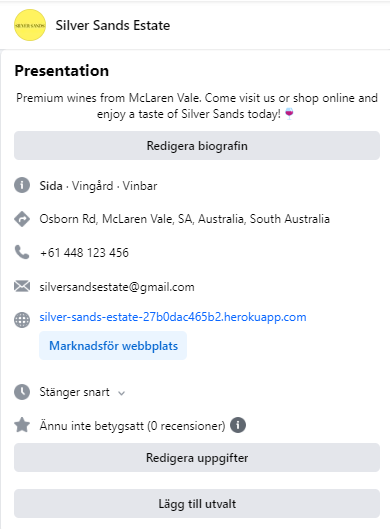
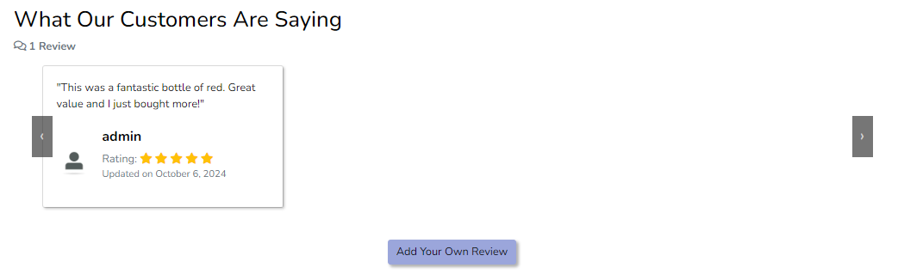

# Silver Sands Estate

You can find the link to [Silver Sands here](https://silver-sands-estate-27b0dac465b2.herokuapp.com/)!

Welcome to Silver Sands Estate, your go-to spot for discovering delicious wines straight from our vineyard! Nestled in a stunning location, we take pride in crafting a diverse range of wines, from smooth reds and crisp whites to vibrant rosés. Each bottle is made with care, capturing the unique flavors and character of our vineyard.

Our online store makes it easy to explore our collection, learn about the story behind each wine, and find the perfect bottle for any occasion. Whether you're a seasoned wine enthusiast or just starting your journey, we've got something special waiting for you. With fast and secure delivery, you can enjoy the taste of Silver Sands Estate wherever you are. So go ahead, take a look around, and let us bring a little bit of our vineyard magic straight to your door. 

Cheers!

Card number for payment testing: **4242424242424242 0428 242 42424** 

## User Experience

The Silver Sands Estate website was meticulously crafted to deliver a visually stunning and intuitive user experience. Designed with the user in mind, the site provides an abundance of choices for customers as they explore our diverse selection of wines. Emphasizing seamless navigation, users can easily find what they’re looking for and complete their purchases with confidence, fulfilling their goals effortlessly.

Our website prioritizes clarity and usability, ensuring that even first-time visitors can navigate through product categories, read about our vineyard's story, and take advantage of special offers without any confusion.

Moreover, the website incorporates functionalities tailored to various personnel roles, ranging from admin to logistics. This holistic approach allows staff members to efficiently manage orders, update inventory, and handle customer inquiries based on their specific responsibilities.

The overarching business goal was to create a scalable and reusable platform that not only meets the current needs of our vineyard but also adapts to future growth and evolving market demands. By designing the website to be user-friendly for both customers and personnel, Silver Sands Estate is committed to fostering a delightful experience for all who visit our online store.

### Target Audience:
Silver Sands Estate is designed for:

* *Wine Enthusiasts:* Whether you’re a seasoned wine lover looking to expand your collection or a casual sipper exploring different flavors, Silver Sands Estate offers a wide variety of wines to suit all palates.

* *Visitors to McLaren Vale:* Tourists and locals visiting the McLaren Vale region who want to experience premium wines directly from the source. They can enjoy our vineyard's rich heritage and taste wines made with care and expertise.

* *Online Shoppers:* Customers who prefer the convenience of purchasing wines online can explore our store, learn about our wines, and have their favorite bottles delivered straight to their doorstep.

* *Gift Seekers:* Those looking for the perfect gift for special occasions, from birthdays to anniversaries, will find a curated selection of beautifully presented wines that make thoughtful and elegant presents.

### Strategy:
Silver Sands Estate's strategy revolves around:

* *Quality Selection:* Continuously producing and offering high-quality wines that reflect the unique flavors of McLaren Vale, ensuring there's something for every taste and occasion.

* *Engaging Experience:* Creating an inviting and informative online platform where visitors can explore our wines, learn about our vineyard’s story, and discover the perfect bottle for their needs.

* *Local and Online Presence:* Building strong relationships with both local visitors and online customers, offering events, tastings, and vineyard tours to enhance their connection with our brand.

## Web Marketing

### Newsletter
The Silver Sands Estate website icludes a powerful newsletter feature, enabling managers to easily create and send newsletters to all customers. This tool allows for streamlined communication, ensuring that customers stay informed about the latest updates and offerings. Managers can also use the app to promote new loyalty programs, automatically sending newsletters that include special promo codes to enhance customer engagement and rewards. This functionality simplifies outreach and marketing efforts, helping businesses maintain strong connections with their customer base through timely and relevant communications.

* Newsletter Signup has been implemented through [EmailOctopus](https://emailoctopus.com/).

* All newsletter signups will be collected through Silver Sands Account at [EmailOctopus](https://emailoctopus.com/)

From the Newsletter list at [EmailOctopus](https://emailoctopus.com/) admins of Silver Sands can send out emails to all subscribers.

### Facebook

At Silver Sands Estate, we understand the importance of connecting with our customers, and Facebook plays a vital role in helping us do just that. With its broad global reach, Facebook allows us to stay engaged with our community.

The Silver Sands Facebook page is made to showcase the latest wine releases, sharing behind-the-scenes vineyard stories and inspire and excite. The facebook page helps Silver Sands to stay up-to-date with everything that's happening at the winery!

You can find the Silver Sands Estate Facebook page through [this link](https://www.facebook.com/profile.php?id=61566537640118)

You can also find images of the Facebook page attached below:

### User Stories:

| New User Stories |
|------------|
| [As a New User](https://github.com/AlvaLind/project-5/issues/26#issue-2559672726), I want to be able to easily browse the wines on the Silver Sands Estate website, so I can explore the selection without needing to create an account. |
| [As a New User](https://github.com/AlvaLind/project-5/issues/27#issue-2559677908), I want to be able to add wines to my cart and go through the checkout process without creating an account, so I can make purchases as a guest. |
| [As a New User](https://github.com/AlvaLind/project-5/issues/3#issue-2499516939), I want to be able to register for an account by providing my email, password, and personal details. |
| [As a New User](https://github.com/AlvaLind/project-5/issues/21#issue-2541194342), I want to search for wines by category so that I can find wines of interest. | 

| Registered User Story |
|-----------------------|
| [As a Registered User](https://github.com/AlvaLind/project-5/issues/5#issue-2499527136), I want to log in to my account with my email and password, so that I can access my personal account information and order history. |
| [As a Registered User](https://github.com/AlvaLind/project-5/issues/6#issue-2499534257), I want to update my personal information (e.g., name, email, shipping address) in my account settings, so that my profile remains current. |
| [As a Registered User](https://github.com/AlvaLind/project-5/issues/12#issue-2531856646), I want to submit a review for a product or service I’ve purchased so that I can share my feedback and help others make informed decisions. |
| [As a Registered User](https://github.com/AlvaLind/project-5/issues/29#issue-2559710935), I want to be able to edit my review so that I can correct or update my feedback. |

| Admin User Story |
|------------------|
| [As an Admin](https://github.com/AlvaLind/project-5/issues/19#issue-2541191946), I want to manage user accounts so that I can maintain the integrity of the user base and handle any issues |
| [As an Admin](https://github.com/AlvaLind/project-5/issues/23#issue-2541201439), I want to approve user reviews so that only appropriate reviews are displayed on the wine detail pages. |
| [As an Admin](https://github.com/AlvaLind/project-5/issues/22#issue-2541200110), I want to upload new wine bottles to the database, so that they can be available for customers to view and purchase on the website. |
| [As an Admin](https://github.com/AlvaLind/project-5/issues/30#issue-2559738225), I want to access customer orders and see the order details and items. |
| [As an Admin](https://github.com/AlvaLind/project-5/issues/30#issue-2559738225), I want to update the order status so that I can keep track of the customer orders. |

You can access all user stories through [this link](https://github.com/users/AlvaLind/projects/7/views/1)

## Business Model
The Business Model is **B2C**, meaning that the company sells products to customers only. It focuses on individual transactions only.

### Necessity for an E-Commerce Business Model

In today’s competitive market, an e-commerce business model for Silver Sands Estate's website is essential to:

- **Expand Customer Reach**: Instead of being limited to local or walk-in customers, your website will allow wine enthusiasts from around the world to access and purchase your products.
- **24/7 Availability**: An online platform ensures that your customers can place orders at any time, increasing potential sales and improving the customer experience.
- **Increased Revenue Streams**: Offering wines, merchandise, or exclusive membership plans online opens up new revenue avenues.

### Value Proposition

- **High-Quality Wine:** Offer premium wines produced from grapes grown in the McLaren Vale region, known for its rich viticultural heritage.

- **Sustainable Practices:** Emphasize eco-friendly farming and production methods, appealing to environmentally conscious consumers.

- **Unique Experience:** Provide customers with a direct connection to the vineyard through storytelling about the origin and craftsmanship of the wines.
    
### Target Market
#### Demographic
- Age: 25-55 years
- Gender: All genders
- Income: Middle - upper-middle class
- Location: Primarily Australia, with potential international shipping.

#### Behavioral Characteristics
- Wine enthusiasts and connoisseurs
- Individuals interested in premium and boutique products
- Consumers who value sustainability and local products

### Customer Persona Summary

Silver Sands Estate caters to a wide-ranging audience, thoughtfully considering the diverse needs and preferences of our customers. Our website is designed for wine enthusiasts aged 18 and older, ensuring a welcoming and engaging experience for all visitors. We prioritize creating an enjoyable user experience by enabling customers to easily discover the wines they seek, and delivering exceptional service throughout their shopping journey.

### Strategy Trade-Off
Silver Sands Estate stands out in the competitive landscape of online wine sales due to our extensive selection of high-quality products and commitment to customer satisfaction.

- A diverse stock of premium wines
- Consistent product availability
- High-quality products
- Broad selection to meet varied tastes
- User-friendly website design

By focusing on these key areas, we aim to create a unique shopping experience that not only meets but exceeds our customers’ expectations, solidifying our reputation as a trusted source for fine wines.

### Marketing Strategies 
Effective marketing strategies are crucial to attracting new customers and retaining existing ones. Here’s how Silver Sands Estate can implement these strategies:

1. Content Marketing 
    - **Blogging:** Regularly publish articles on wine education, food pairings, vineyard updates, and behind-the-scenes insights. This positions Silver Sands as a knowledgeable leader in the industry.

    - **Video Content:** Create videos showcasing the vineyard, wine production processes, and tasting tips. Share these on social media and the website to enhance engagement.

2. Social Media Marketing
    - **Visual Storytelling:** Use platforms like Instagram and Facebook to share high-quality images of the vineyard, wine bottles, and tasting events, appealing to visual-driven customers.

    - **Influencer Partnerships:** Collaborate with wine influencers and bloggers to reach a broader audience. Influencers can create authentic content that resonates with their followers.

3. Email Marketing Campaigns
    - **Regular Newsletters:** Send monthly newsletters featuring new product launches, promotions, wine tips, and upcoming events. Ensure the content is valuable and engaging to keep subscribers interested.

    - **Exclusive Offers for Subscribers:** Provide special discounts or early access to new wines for email subscribers to incentivize sign-ups.

4. Search Engine Optimization (SEO)
    - **Optimize Website Content:** Ensure the website is optimized for search engines with relevant keywords related to wine, McLaren Vale, and sustainable practices to attract organic traffic.

    -**Local SEO:** Implement local SEO strategies to target customers searching for vineyards and wine in the McLaren Vale area, enhancing visibility for nearby shoppers.

5. Paid Advertising
    - **Social Media Ads:** Run targeted ads on platforms like Facebook and Instagram to reach specific demographics interested in wine and gourmet food.

    - **Google Ads:** Use Google Ads to target keywords related to wine purchasing, local vineyards, and related queries to capture potential customers actively searching for products.

### Customer Retention Strategies
Retaining existing customers is often more cost-effective than acquiring new ones. Here are several strategies that Silver Sands Estate can implement to enhance customer loyalty and retention:

1. Loyalty Program
    - **Rewards for Purchases:** Introduce a loyalty program where customers earn points or levels based on purchase history that can be redeemed for discounts, free products, or exclusive experiences (e.g., vineyard tours).

2. Personalized Communication
    - **Targeted Email Campaigns:** Use customer purchase history to send personalised recommendations, birthday discounts, or exclusive offers. Tailoring content to individual preferences increases engagement.

    - **Customer Segmentation:** Segment the email list based on interests, demographics, or purchase behavior to send relevant promotions and updates.

3. Exceptional Customer Service
    - **Responsive Support:** Provide multiple channels for customer support (email, chat, phone) to quickly address inquiries and issues. Aim for quick response times to build trust and satisfaction.

    - **Follow-Up After Purchase:** Send follow-up emails after purchases to thank customers, encourage feedback, and suggest complementary products.

4. Engagement through Social Media
    - **Community Building:** Foster a sense of community on social media by engaging with customers through polls, questions, and sharing user-generated content.

    - **Exclusive Social Media Offers:** Provide exclusive promotions or discounts to social media followers to incentivize engagement and build loyalty.

5. Customer Feedback Loop
    - **Surveys and Reviews:** Regularly solicit feedback through surveys and encourage reviews on the website and social media. Use this information to improve products and services.

### Conclusion
Our business model provides a clear framework for Silver Sands Estate as it transitions to an online e-commerce platform. By understanding customer and personnel personas, the company can tailor its strategies to meet the needs of its target market effectively. Engaging marketing, operational efficiency, and a strong value proposition will be key to the success of this online venture.

## Design

### Color Scheme

Silver Sands Estate's color palette beautifully reflects the essence of our vineyard and the inviting experience we offer.

* **#FFF460 as header and navbar + back-buttons.**
This yellow color adds a warm, sunny touch that evokes the bright and cheerful atmosphere of a day spent at the vineyard. This vibrant hue instills a sense of friendliness and approachability.
* **#9BA6DB for primary buttons.**  
The primary buttons serve as a soothing, calming presence, inviting users to explore further with their gentle blue tones. This color reflects trust and reliability, encouraging visitors to make selections with confidence.
* **#E0E0E0 for secondary buttons**
The secondary buttons offers a neutral, soft gray tone that complements primary colors without drawing too much attention. This shade provides a subtle contrast, ensuring secondary actions remain visible but don't overpower the primary call-to-action. 
* **#FFFFFF for background color.**
The background creates a clean and fresh canvas, allowing our content to shine and ensuring easy readability. Against this crisp backdrop, the #000000 text provides striking contrast, making every word clear and engaging.
* **#000000 as text and footer colour.**
The black color offers a clarity and sharp contrast against the lighter background. This color exudes reliability and professionalism, guiding users effortlessly as they navigate through Silver Sands's website.

Together, these colors create a harmonious and inviting environment, perfectly encapsulating the charm of Silver Sands Estate. Visitors are not only welcomed by an aesthetic appeal but also encouraged to immerse themselves in our story and offerings.

### Typography

The font used on the website is Nunito and Spectral. The fonts have been imported by [Google Fonts](https://fonts.google.com/).

*Nunito* is a well-rounded, sans-serif typeface that offers a modern and friendly appearance. It features a balanced structure with soft, rounded terminals, making it highly readable and approachable.

 The logo features the elegant *Spectral* font, which beautifully encapsulates the sophistication and heritage of Silver Sands Estate. This serif font combines classic charm with contemporary flair, making it the perfect choice for representing our brand. Spectral’s distinct character adds a sense of prestige and authenticity, reflecting the craftsmanship that goes into every bottle of wine we produce.

 

 Together, these fonts create a harmonious balance that not only captures the essence of our vineyard but also resonates with our visitors, inviting them to explore the world of Silver Sands Estate with enthusiasm and ease.

### Icons
The icons on the website are imported from [Font Awesome](https://fontawesome.com/), enhancing the user experience on versatile websites by providing essential visual cues.

### Wireframes

You can access the figma planning board through [this link.](https://www.figma.com/design/REjGEL3MlzLIrUCkLReV3u/Wireframes-Silver-Sands?node-id=1669-162202&m=dev&t=BvBHDmAuTxkNcV5o-1)

You can also access the wireframes through the links below.
* [Desktop Wireframes](https://github.com/AlvaLind/project-5-silver-sands/tree/main/documentation/wireframes/desktop_view)
* [Mobile Wireframes](https://github.com/AlvaLind/project-5-silver-sands/tree/main/documentation/wireframes/phone_screen)

## Features

### Navbar

For users, the navbar contains of the following:
- Silver Sands Estate logo
- All Wines
- Our Story
- Visit Us
- Searchbar/Magnifying glass
- Login
- Sign Up
- Shopping Cart

For registered users, the navbar contains of the following:
- Silver Sands Estate logo
- All Wines
- Our Story
- Searchbar
- Visit Us
- Searchbar
- Profile page
- Favourites
- Logout
- Shopping Cart

For admin users, the navbar contains of the following:
- Silver Sands Estate logo
- All Wines
- Our Story
- Searchbar
- Visit Us
- Searchbar
- Profile page
- Favourites
- Logout
- Product Management
- Shopping Cart

### Admin:

The admin can:
- Add new products

- Manage orders and see order metrics

### Footer:

The footer contains:
- Silver Sands Estate logo
- Company description
- Social media links
- Explore section with page links
- Company details/contact section
- Copyright tag

### Homepage:

The homepage contains: 
- Hero image of two drawn hands holding wine glasses and Silver Sands Estate introduction text.
- Button to start browsing through the quality wines of Silver Sands Estate.

### Wine list:

The 'All Wines' page contains of a paginated list of wines. The 'All wines' page also includes a filter function where users can filter or sort the wines by different alternatives.

#### Filter feature:

#### Sort By feature

### Wine details:

The Wine details page contains:
- Go back to previous page button.
- Wine image
- Wine details
- Average rating

Registered users:
- Button to add/remove to/from Favourites
- Review section

### User Profile:
 The user profile contains:

- Delivery Details Form
- Order History

When clicking on one of the orders in 'Order History' the registered user will get taken to the order confirmation that is displaying more details about their order.

### Bag

The Shopping Bag contains of an order summary where the customer can choose to increase/decrease the volume of items in the order or remove one item all together.

The bag contains of the following price information:
- Price Information per item
- Price Information total per wine sort
- Price Information without shipping costs
- Price Information shipping
- A Grand total

### CheckOut

The checkout contains of an order form with delivery details and a field for card details.

### Age Verification

Before the customers can start browsing the Silver Sands Website they need to verify that they are above 18 years old.

If the customer clicks 'Yes' they will be allowed onto the Silver Sands website. If they click 'No' they will be redirected here:

### Favicon

The [Favicon](https://favicon.io/) is a small image displayed in the browser's address bar. It helps users identify the website among others and makes it easier to find when browsing or searching.

## Technologies used

### Languages:

* [Python 3.12.1](https://www.python.org/downloads/release/python-3121/): for developing the server-side functionality of the website.
* [JavaScript](https://www.javascript.com/): to create interactive components and enhance user experience on the website.
* [HTML](https://developer.mozilla.org/en-US/docs/Web/HTML): to structure and organize the content of the website.
* [CSS](https://developer.mozilla.org/en-US/docs/Web/CSS): to style and design the visual presentation of the website.

### Frameworks and libraries:
* [Django](https://www.djangoproject.com/): Python framework utilized to implement all server-side logic and functionality.
* [jQuery](https://jquery.com/): Used to manage click events and handle AJAX requests for dynamic interactions on the website.
* [jQuery UI](https://jqueryui.com/): Implemented to create interactive elements and enhance user interface components.

### Databases:
* [SQLite](https://www.sqlite.org/): was used as a development database.
* [PostgreSQL](https://www.postgresql.org/): the database used to store all the data. 

### Other tools:
* [Visual Studio Code](https://code.visualstudio.com/) was the IDE used to develop the website.
* [Git](https://git-scm.com/) was used as the version control system used to manage the code.
* [GitHub](https://github.com/) was used to host the code of the website.
* [Pip3](https://pypi.org/project/pip/) was the package manager used to install the dependencies.
* [Gunicorn](https://gunicorn.org/) was the webserver used to run the website.
* [Whitenoise](https://whitenoise.readthedocs.io/en/stable/django.html) was used to simplify the process of handling static assets when deploying.
* [Cloudinary](https://cloudinary.com/?utm_campaign=1329&utm_content=instapagelogocta-selfservetest) was used for managing, optimizing, and delivering images and videos through cloud storage.
* [Django Summernote](https://pypi.org/project/django-summernote/) was used for providing a user-friendly interface for creating and editing text content.
* [Django Crispy forms](https://django-cryptography.readthedocs.io/en/latest/) was used to control the rendering behavior of Django forms.
* [Django allauth](https://django-allauth.readthedocs.io/en/latest/) was the authentication library used to create the user accounts.
* [Django Countries](https://pypi.org/project/django-countries/) for country dropdown field.
* [Chrome DevTools](https://developer.chrome.com/docs/devtools/open/) was used to debug the website.
* [Stripe](https://stripe.com/en-se) for payment processing.
* [Amazon Web Services](https://aws.amazon.com/) for S3 bucket to store static files.
* [EmailOctopus](https://emailoctopus.com/) for newsletter signup.
* [W3C Validator](https://validator.w3.org/) was used to validate HTML5 code for the website.
* [W3C CSS Validator](https://jigsaw.w3.org/css-validator/) was used to validate CSS code for the website.
* [JShint](https://jshint.com/) was used to validate JS code for the website.
* [Pep8](https://pep8ci.herokuapp.com/) was used to format the code to make it more readable and consistent.
* [Favicon](https://favicon.io/) to add the browser icon.
* [Canva](https://www.canva.com/) to create the logo and banner.
* [Pikwy](https://pikwy.com/) to create screenshots of full pages.
* [Font Awesome](https://fontawesome.com/) was used to create the icons used in the website.
* [Coolors](https://coolors.co/) was used to make a color palette for the website.
* [Miro](https://miro.com/) to create wireframes.
* [Figma](https://www.figma.com/) to show user flow.
* [Privacy Policy Generator](https://www.privacypolicygenerator.info/) to create the privacy policy.
* [XML-Sitemaps]{https://www.xml-sitemaps.com/} to create my sitemap.xml.

## Structural Design

### Database 

The PostgreSQL database was provided by [Code Institute](https://codeinstitute.net/global/)

### Entity Relationship Diagram

The ERD was created via [Lucid charts](https://lucid.app/)

### Data Modelling 

#### UserProfile 
When user signs up, a new profile is created.

#### Category Model

#### Wine Model

#### Closure Choices
When a Wine item is created a field named closure in relation to the cork type is selected from this list of options.

#### Reviews Model 

#### Order Model

#### Order Status Options
When an Order item is created a field named status in relation to the status of the order is created and a choice is selected from this list.

#### OrderLineItem Model

## Agile Methodology
I used GitHub Project Management to manage this project. This approach allowed me to efficiently add new features and updates, prioritize the tasks and to keep track of my progress.

You can locate the Silver Sands Estate backlog through [this link](https://github.com/users/AlvaLind/projects/7)

## Testing
Please refer to the [TESTING.md](https://github.com/AlvaLind/page-turner/blob/main/TESTING.md) for test-related documentation.

## Deployment

- The app was deployes to [Heroku](https://heroku.com/).
- The PostgreSQL database was provided by [Code Institute](https://codeinstitute.net/se/).
- You can access the app through [this link](ADD LINK)

Please refer to the [DEPLOYMENT.md]() file for all deployment and payment-related documentation.

## Credits

- [Django](https://www.djangoproject.com/) for the framework libraries.
- [GitHub](https://github.com/) for storing, tracking and management of files and development managment.
- [Miro](https://miro.com/app/board): for project designing and planning including ERD builder.
- [Lucidchart](https://lucid.app/documents) to create my flowchart for the initial idea.
- [Font awesome](https://fontawesome.com/): for the free access to icons.
- [Heroku](https://www.heroku.com/): for the hosting of the Page Turner website.
- [jQuery](https://jquery.com/): for providing varieties of tools to make standard HTML code look appealing.
- [Coolors](https://coolors.co/): for providing tools to generate your own colour palette for design purposes.
- [Postgresql](https://www.postgresql.org/): for providing a free database.
- [Code Institute](https://codeinstitute.net/se/): for video tutorials and Django content helping with project structure
- ["Cloud with Django"](https://www.youtube.com/watch?v=JQVQcNN0cXE) for help to set up my AWS storage.
- [Stackoverflow - "Create webhook receiver"](https://stackoverflow.com/questions/53974149/django-create-webhook-receiver) for help to set up and understand webhook reciever

- Images are from [Freepik](https://www.freepik.com/popular-photos)
- AI generated images are also from [Freepik](https://www.freepik.com/popular-photos)

## Acknowledgements

I am very grateful for the mental support I have gotten from my boyfriend Jordan during this project!